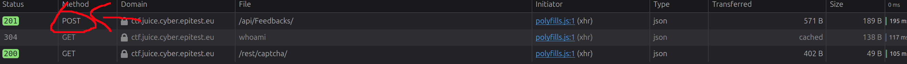
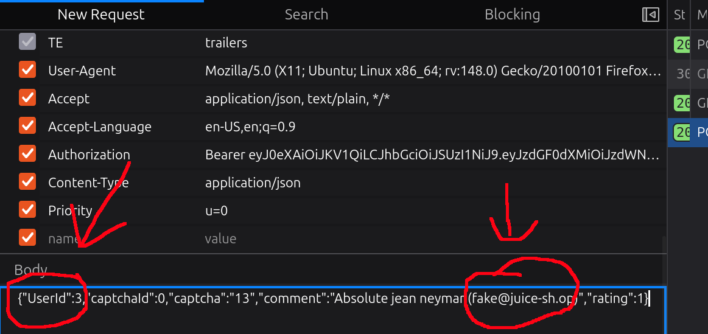

# Forged Feedback 3*:

## Description of the challenge:
Post some feedback in another user's name. (Difficulty Level: 3)

## Methodology:
### Steps:
- 1: Go to the feedback page, look through the HTTP requests that happen when you send feedbakce and find the request that sends the data.

- 2: Click "Edit and Resend"

- 3: Scroll to the body and change the UserID and the email adress in the comment:

### Techniques:
- Scan
- HTTP request

### Tools:
- The inspect element tool from Firefox.
## Vulnerabilities:

### Name: 
Broken Access Control
### Affected components:
- The database
### Severity Level:
- Low (It can only affect user feedback).

## Risks:
### Impact:
- Could potentially be used to send massive amounts of feedback, thus clogging the line. It could also have a bigger impact if a user writes feedback with malicious intent, prentending to be an admin, hoping someone inexperienced sees it, and writes in a fake fix which would create more vulnerabilities.

## Actions:
### Risk mitigation strategies:
- Monitor network traffic to quickly detect unusual patterns (if the same ip adress sends many feedback requests, there might be a problem)
### Remediation fixes:
- Set the author on server-side based on the user retrieved from the authentication token in the HTTP request. If that user doesn't exist, don't accept the request
### Related best security practices
- 
