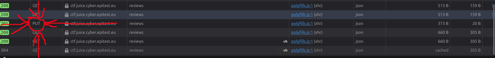
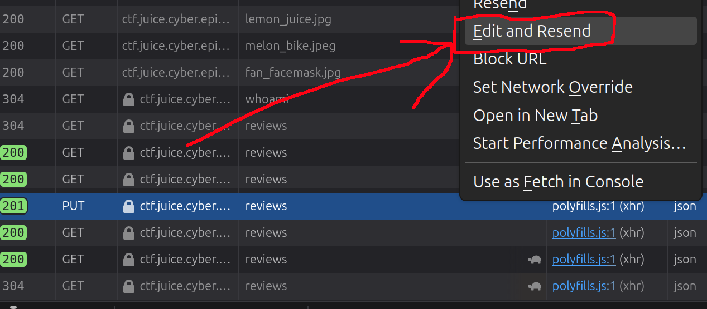
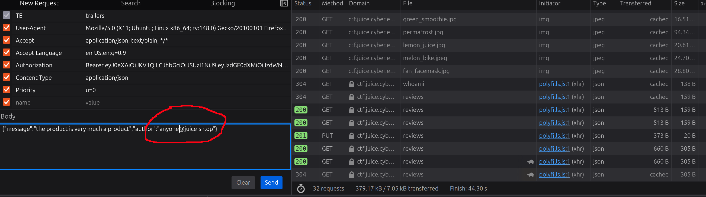

# Forged Review 3*:

## Description of the challenge:
Post a product review as another user or edit any user's existing review. (Difficulty Level: 3)

## Methodology:
### Steps:
- 1: Look through the HTTP requests that happen when you send a review and find the request that sends the data.

- 2: Click "Edit and Resend"

- 3: Scroll to the body and change the author to: "*anything you want*@juice-sh.op"

### Techniques:
- Scan
- HTTP request

### Tools:
- The inspect element tool from Firefox.
## Vulnerabilities:

### Name: 
Broken Access Control
### Affected components:
- The database
### Severity Level:
- Low (It can only affect reviews).

## Risks:
### Impact:
- Could potentially harm competition by allowing companies to review bomb competitors products

## Actions:
### Risk mitigation strategies:
- Monitor network traffic to quickly detect unusual patterns (if the same ip adress sends many reviews, there might be a problem)
### Remediation fixes:
- Set the author on server-side based on the user retrieved from the authentication token in the HTTP request. If that user doesn't exist, don't accept the review
### Related best security practices
- 
