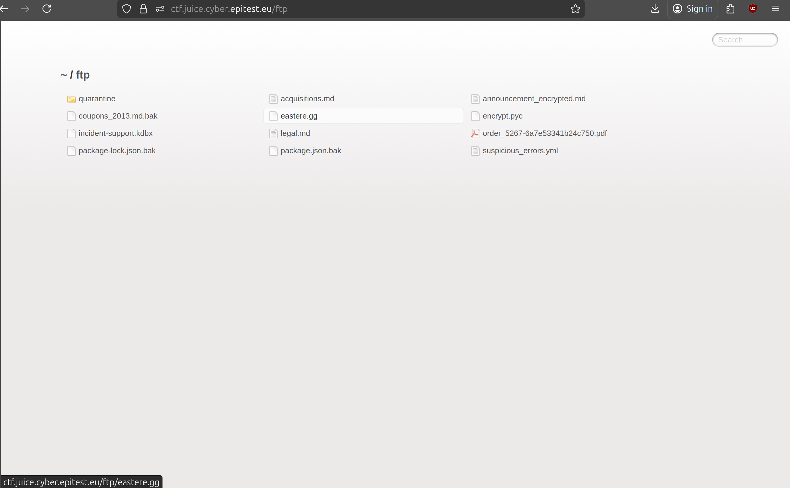
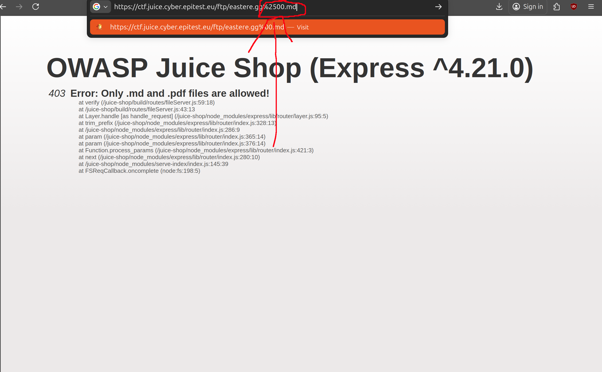

# Easter Egg 4*:

## Description of the challenge:
Find the hidden easter egg. (Difficulty Level: 4)

## Methodology:
### Steps:
- 1: First, figure out was a poison null byte is, [See_the_poison_null_byte_flag](<../Improper Input Validation/Improper Input Validation-4-Poison Null Byte.md>)

- 2: Go to https://ctf.juice.cyber.epitest.eu/ftp and find a eastere.gg

- 3: Add the Poison Null Byte to the end of the URL

### Techniques:
- Research
- Brute force

### Tools:
- [SecWiki](https://wiki.zacheller.dev)
## Vulnerabilities:

### Name: 
Improper Input Validation
### Affected components:
- Secret Files
### Severity Level:
- (jsp va poser la question)

## Risks:
### Impact:
- Could potentially be used to reveal dev files and coupons and such prematurely to the public.

## Actions:
### Risk mitigation strategies:
- Clean up the files before making changes
### Remediation fixes:
- Don't leave unused files on the ftp and do not let normal users access the ftp.
### Related best security practices
- 
