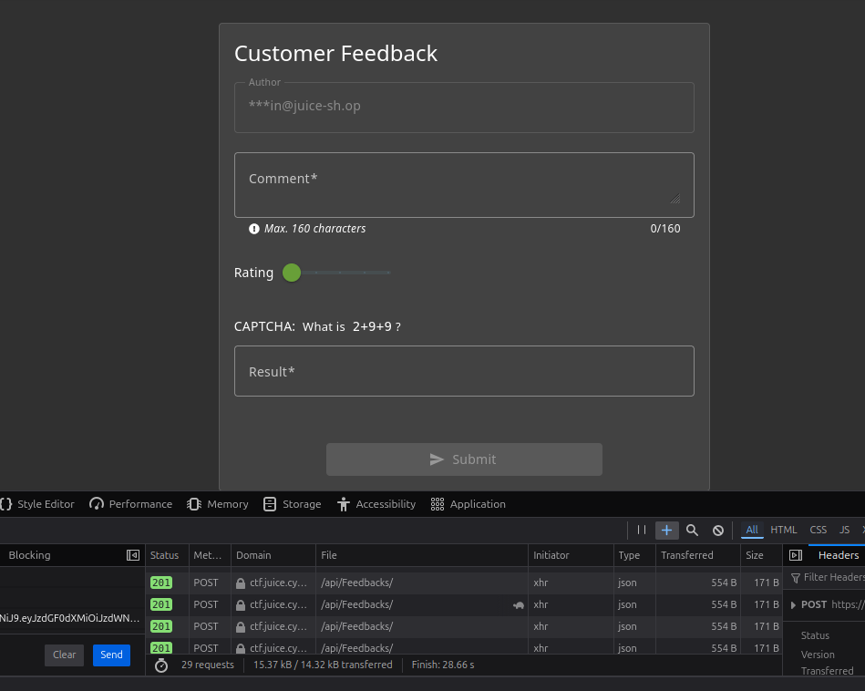
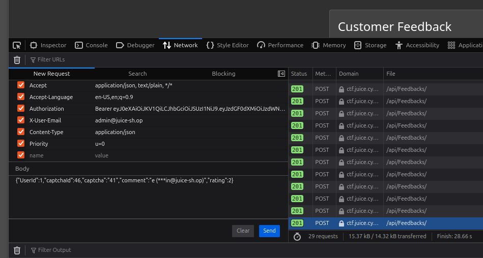

# Captcha Bypass 3*:

## Description of the challenge:
Submit 10 or more customer feedbacks within 20 seconds. (Difficulty Level: 3)

## Methodology:
### Steps:
- 1: Go to the feedback page, look through the HTTP requests that happen when you send feedbakce and find the request that sends the data.

- 2: Click "Edit and Resend"

- 3: Resend it without modification 10 or more times in quick succession:

### Techniques:
- Scan
- Brute force

### Tools:
- The inspect element tool from Firefox.
## Vulnerabilities:

### Name: 
Broken Anti Automation
### Affected components:
- The database
### Severity Level:
- Medium (It can only affect user feedback, but could be used to DDOS the site through sheere amount of requests).

## Risks:
### Impact:
- Could potentially be used to send massive amounts of feedback, thus clogging the line.
(DDOS)

## Actions:
### Risk mitigation strategies:
- Monitor network traffic to quickly detect unusual patterns (if the same ip adress sends many feedback requests, there might be a problem)
### Remediation fixes:
- Set the author on server-side based on the user retrieved from the authentication token in the HTTP request. If that user doesn't exist, don't accept the request
### Related best security practices
- 
