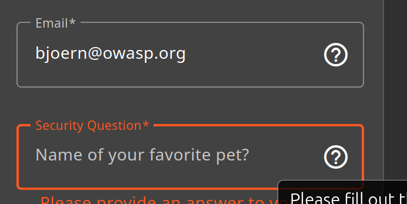
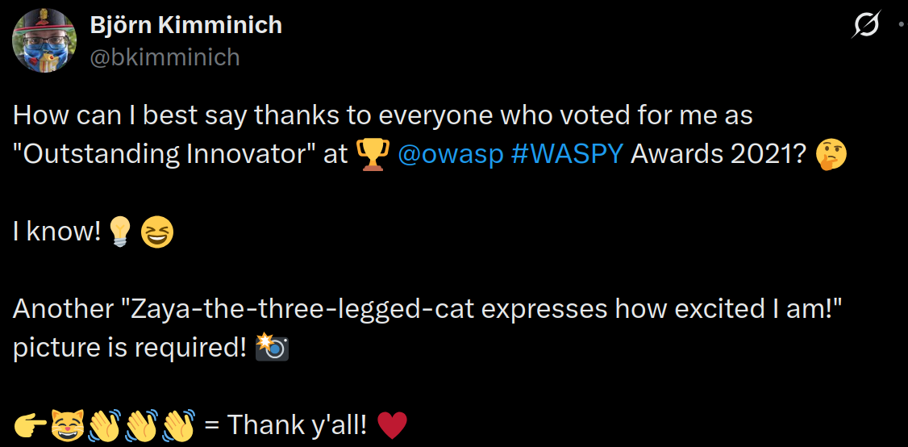

# Reset Bjoern's Favorite Pet 3*:

## Description of the challenge:
Reset the password of Bjoern's OWASP account via the Forgot Password mechanism with the original answer to his security question. (Difficulty Level: 3)

## Methodology:
### Steps:
- 1: Let's go have a look at what Uvogin's security question is, for that, let's access the admin panel like we did for [Login_bender](../Injection/Injection-3-Login%20Bender.md) or [Login_Jim](../Injection/Injection-3-Login%20Jim.md) and figure out Bjorn's email address. They have three, so I inputted the three of them into forgot your password and the one that came up with the question what was bjoern@owasp.org

- 2: Then, by going through his twitter, we find a post about his "three legged cat Zaya"

- 3: We just input that as the answer to the security question and we can change the password

### Techniques:
- Research

### Tools:
- [Twitter](https://x.com)
## Vulnerabilities:

### Name:
- Broken Authentification

### Affected components:
- The users account
### Severity Level:
- VERY HIGH
## Risks:
### Impact:
- Could be used to retrieve users information, and order massive amounts of goods on their credit cards, this is very bad

## Actions:
### Risk mitigation strategies:
- The site should use A2F or Bjoern should change their security question
### Remediation fixes:
- Change the security question
### Related best security practices
- Using A2F
