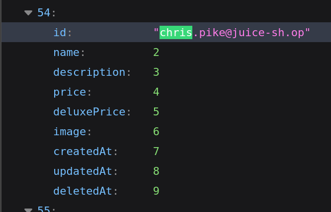
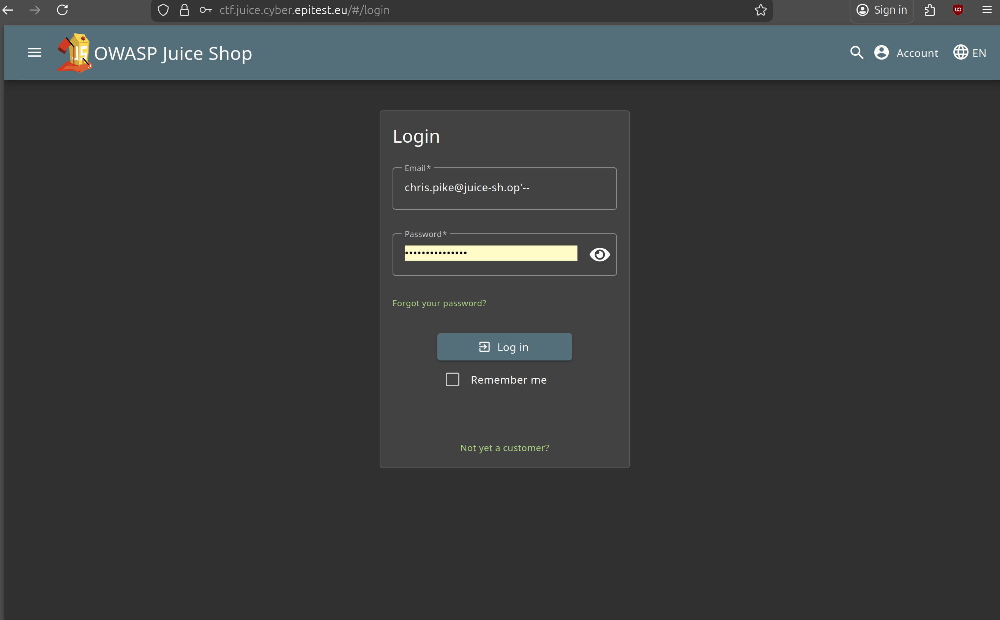

# GDPR Data Erasure 4*:

## Description of the challenge:
Log in with Chris' erased user account. (Difficulty Level: 3)

## Methodology:
### Steps:
- 1: First, we need to check if they deleted chris' old account from the database, since if they didn't, we can access it using the same SQL injection we used for [Login Jim](../Injection/Injection-3-Login%20Jim.md). We can check the database directly since we already accessed it wth the User Credential flag: [User Credential](./Injection-4-User%20Credentials.md)
And we indeed find it:

- 2: We can simply login using the same process that we did for login Jim and there we go: 

### Techniques:
- Research
- SQL Injection

### Tools:
- Inspect
## Vulnerabilities:

### Name: 
- Broken Authentification
### Affected components:
- Basket Content
### Severity Level:
- LOW

## Risks:
### Impact:
- Medium, could cause annoyance with users because you could still send them promotional messages, would also put said user at risk in case of a data breach.

## Actions:
### Risk mitigation strategies:
- Regularly check if a user's account has been deleted, if so, remove them from the database
### Remediation fixes:
- Delete old users
### Related best security practices
- 
