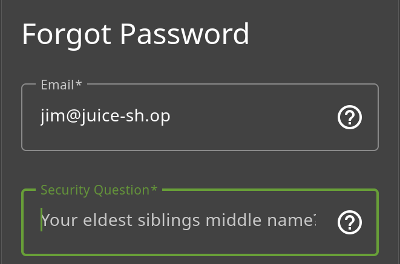
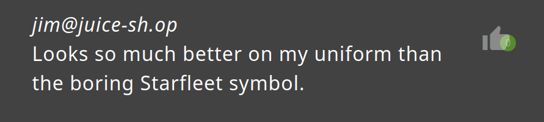
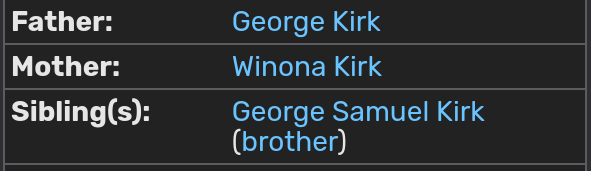

# Reset Jim's Password 3*:

## Description of the challenge:
Reset Jim's password via the Forgot Password mechanism with the original answer to his security question. (Difficulty Level: 3)

## Methodology:
### Steps:
- 1: First, we need to go to the "forgot password page", accessed via the login menu.

- 2: Then we can see his security question, "Your eldest siblings middle name?". Let's try to figure out who Jim is to know what his eldest sibling is called, for that, if you look at the review for the OWASP Juice Shop-CTF Velcro Patch we can see him talk about Starfleet, which is from Star Trek, therefore, we can deduce that Jim is Captain James T. Kirk from Star Trek

- 3: By using any search engine (or being a geek and having watched the show) we quickly find the middle name of his older brother which is Samuel

- 4: We can then simply type any new password and reset Jim's.

### Techniques:
- Research

### Tools:
- [fandom_star_trek](https://memory-alpha.fandom.com/wiki/James_T._Kirk)
## Vulnerabilities:

### Name:
- Broken Authentification

### Affected components:
- The users account
### Severity Level:
- VERY HIGH
## Risks:
### Impact:
- Could be used to retrieve users information, and order massive amounts of goods on their credit cards, this is very bad

## Actions:
### Risk mitigation strategies:
- The site should use A2F or Jim should change their security question
### Remediation fixes:
- Change the security question
### Related best security practices
- Using A2F
