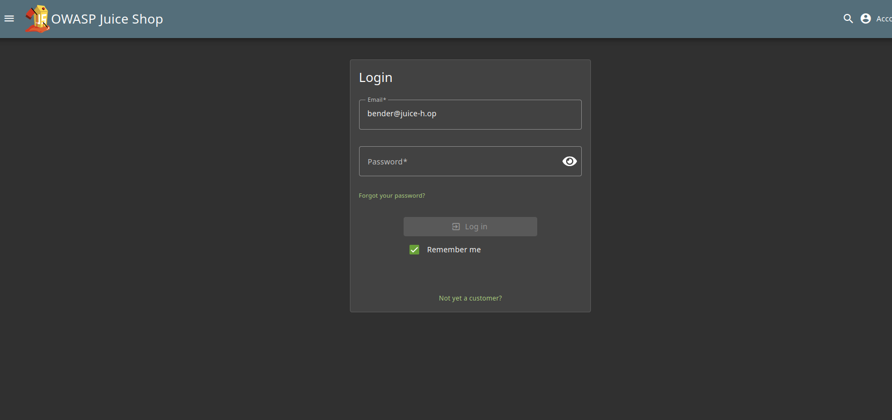
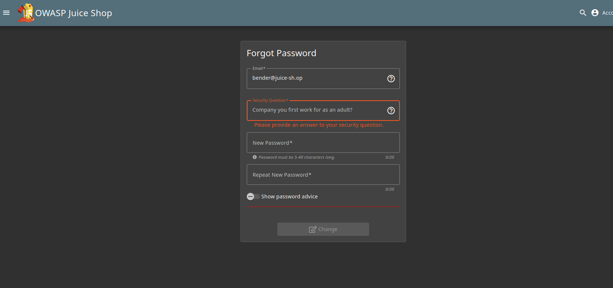
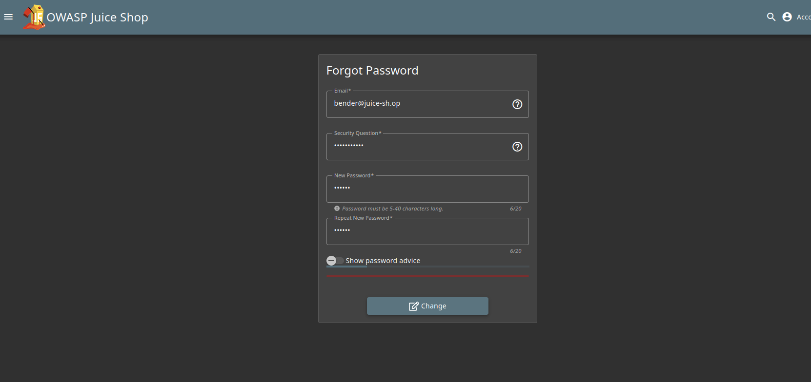

# Reset Bender's Password 4*:

## Description of the challenge:
Reset Bender's password via the Forgot Password mechanism with the original answer to his security question. (Difficulty Level: 4)

## Methodology:
### Steps:
- 1: First, we need to go to the "forgot password page", accessed via the login menu.

- 2: Then we can see his security question, "Company you first work for as an adult" by using any search engine (or being a geek and having seen the show Futurama) we quickly find the name of Bender's first job Stop'n'Drop.

- 3: We can then simply type any new password.

### Techniques:
- Research

### Tools:
- Futurama wiki
## Vulnerabilities:

### Name:
- Broken Authentification

### Affected components:
- The users account
### Severity Level:
- VERY HIGH
## Risks:
### Impact:
- Could be used to retrieve users information, and order massive amounts of goods on their credit cards, this is very bad

## Actions:
### Risk mitigation strategies:
- Ask employees to use less accessible information for their security questions, anything that can be found with a quick search is not suitable.
### Remediation fixes:
- 
### Related best security practices
- 
