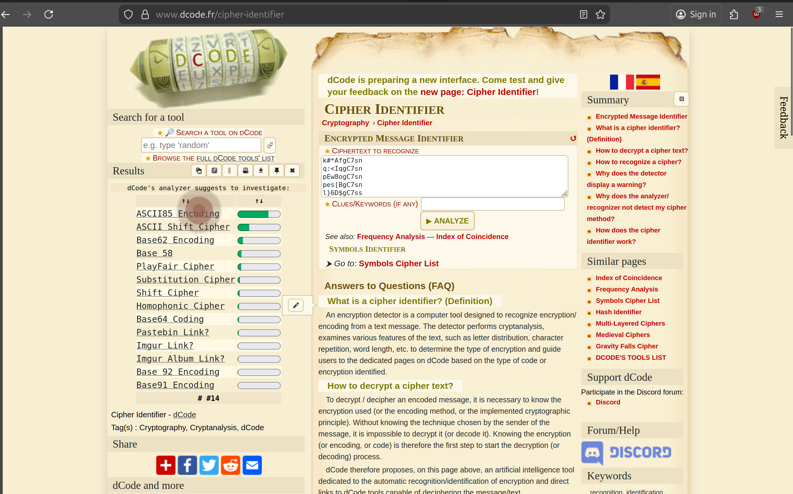
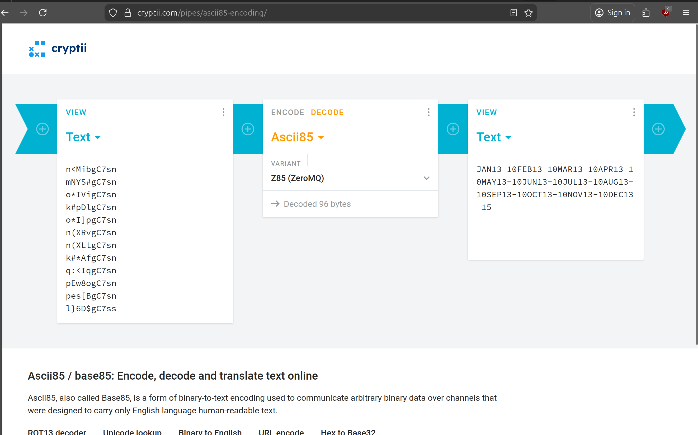
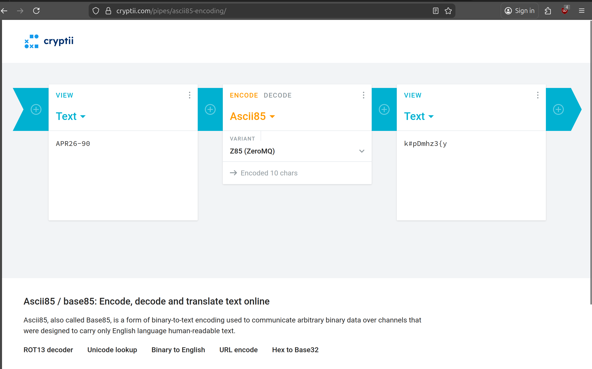

# Forged Coupon 6*:

## Description of the challenge:
Forge a coupon code that gives you a discount of at least 80%. (Difficulty Level: 6)

## Methodology:
### Steps:
- 1: First we need to figure out how the coupons are encoded, for that we can take the file we found while doing the [Forgotten_sales_flag](../Sensitive%20Data%20Exposure/Sensitive%20Data%20Exposure-4-Forgotten%20Sales%20Backup.md) since this file contains a list of coupons for 2013 and put the text inside into a cipher identifier

- 2: Decoding it as ASCII85 Z85 we get the list of coupons, (I had to use another site because dcode could not decode it for some reason)

- 3: Looking at the coupons, we can see that they have a format, the format is: MMMYY-RR (where MMM is the three first letters of the month, YY is the two last digits of the Year and RR is the percentage reduction that the coupon code offer). So I tried rencoding a coupon with a valid date but 90% reduction, so APR26-90

- 4: It then placed an order and inputted it as the coupon and it worked. (Note: Unfortunately 100% does not work as coupons have to be 10 characters long and APR26-100 is 12 characters long)

### Techniques:
- Research
- Cryptography

### Tools:
- [Dcode](https://www.dcode.fr/cipher-identifier)
- [Cryptii](https://cryptii.com/pipes/ascii85-encoding/)
## Vulnerabilities:

### Name: 
Cryptographic Issues
### Affected components:
- Checkout
### Severity Level:
- Very High

## Risks:
### Impact:
- Users can order many expensives items at a heavily reduced price, thus making the store pay more for the items than they get back by selling them

## Actions:
### Risk mitigation strategies:
- Check every order to see if they are asking for to big of a reduction and void them in that case.
### Remediation fixes:
- Do not use a fixed format for encryption or create one yourself
### Related best security practices
- Do not use a fixed format for encryption or create one yourself
