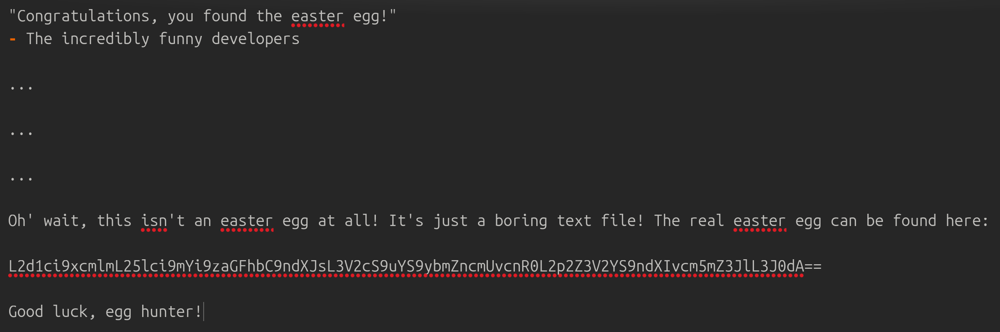
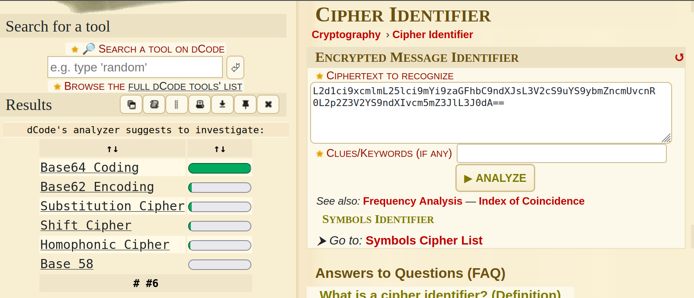
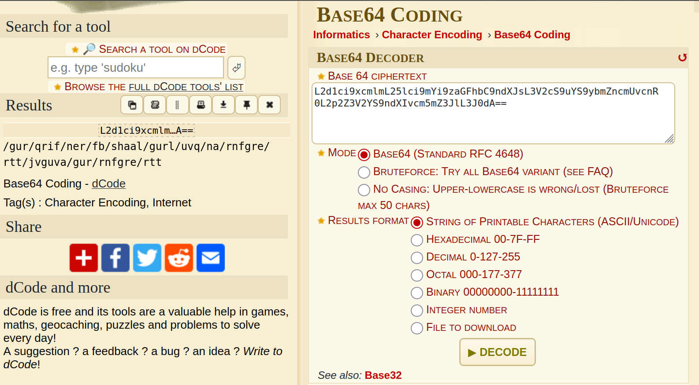
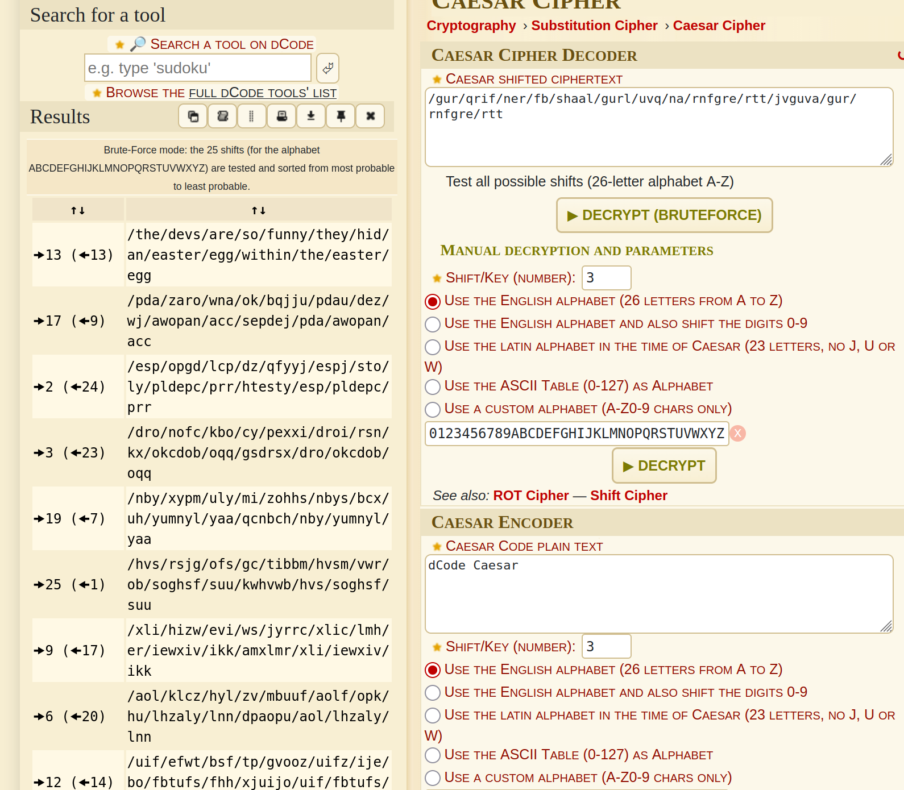

# Nested Easter Egg 4*:

## Description of the challenge:
Apply some advanced cryptanalysis to find the real easter egg. (Difficulty Level: 4)

## Methodology:
### Steps:
- 1: We already have the first part of the easter egg thank to the [easter_egg](../Broken%20Access%20Control/Broken%20Access%20Control-4-Easter%20Egg.md) flag. So we can read it: here is what we find. 

- 2: The real easter egg doesn't make any sense so it is probably encoded, so I used a cipher identifier to figure out how it was encoded. 

- 3: We can see that it was encoding using Base64 Coding, so let's try decoding it:

- 4: It looks like a path to a file, but the letters are jumbled, it looks like caesar cipher, so let's try to decode it again

- 5: this looks like the rest of a URL, so we add it after the site URL and we get the result

### Techniques:
- Research
- Cryptography

### Tools:
- [Dcode](https://www.dcode.fr/cipher-identifier)
## Vulnerabilities:

### Name: 
Cryptographic Issues
### Affected components:
- None
### Severity Level:
- None, this is an easter egg

## Risks:
### Impact:
- None as it is an easter egg

## Actions:
### Risk mitigation strategies:
- Don't leave an easter egg in the files
### Remediation fixes:
- Don't leave an easter egg in the files
### Related best security practices
- Don't leave an easter egg in the files
