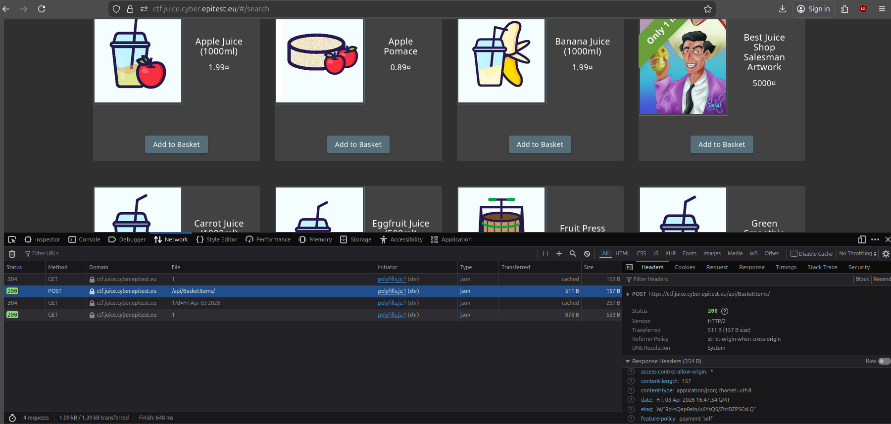
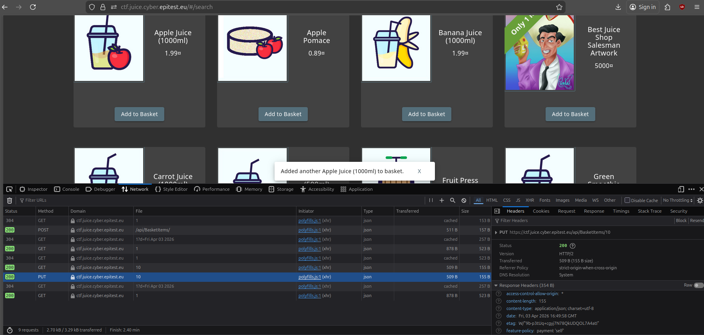
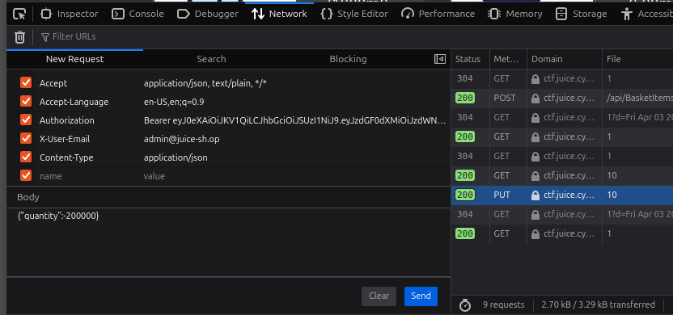
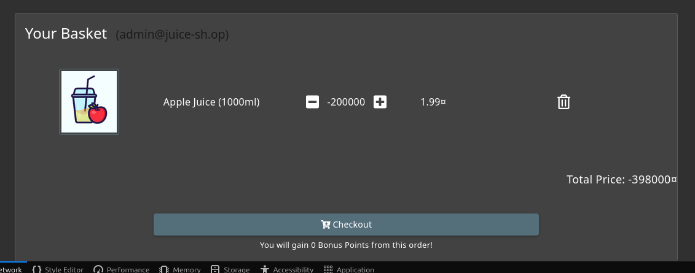
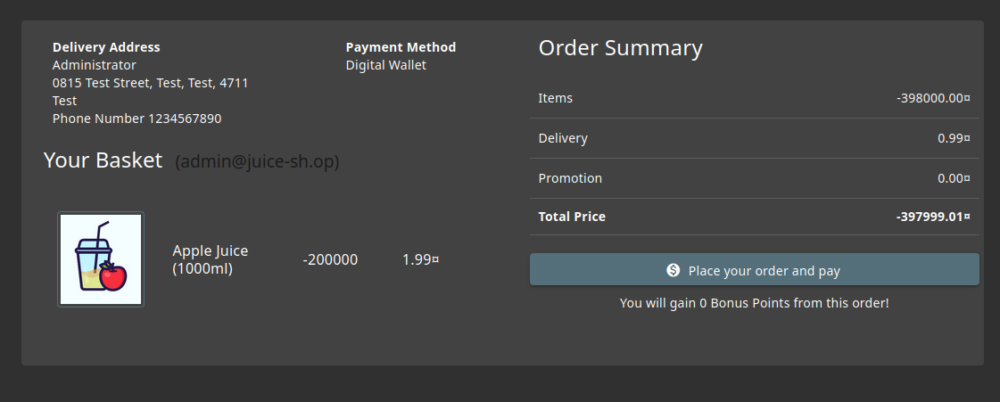
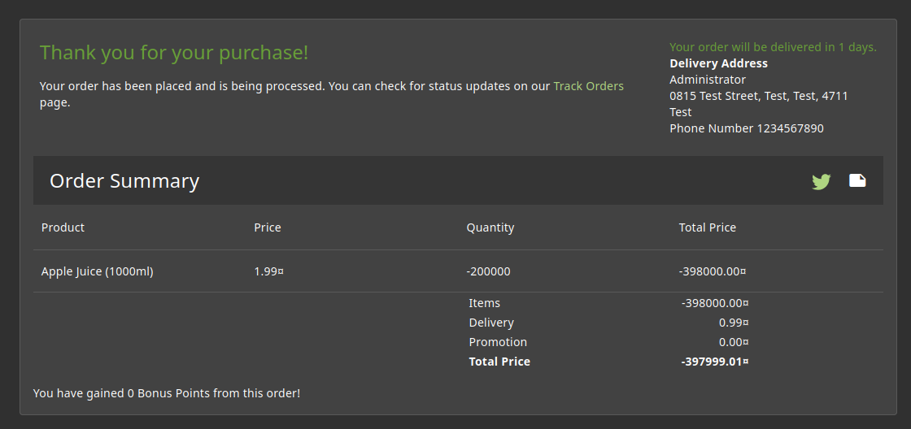

# Payback Time 3*:

## Description of the challenge:
Place an order that makes you rich. (Difficulty Level: 3)

## Methodology:
### Steps:
- 1: First we need to add any object to our basket, with the inspect tool open. Wecan see the request's method is POST.

- 2: If we tried to resend the request with a different qauntity it would fail, because the POST request can only be used to add the first item of a kind to the basket, if we add the same item another time the request is now PUT

- 3: We can edit and resend this scond request with a negative amount of -200000

- 4: Then we can proceed as normal to the checkount, and get rich !

### Techinques:
- Research
- Request edition

### Tools:

## Vulnerabilities:

### Name: 
Improper Input Validation
### Affected components:
- Basket, and price of orders
### Severity Level:
- HIGH

## Risks:
### Impact:
- Could be used to take large amount from the shop bank account if there are no protections.

## Actions:
### Risk mitigation strategies:
-  negative prices when proceeding t checkout.
### Remediation fixes:
- Block negative quantities in the basket.
### Related best security practices
- 