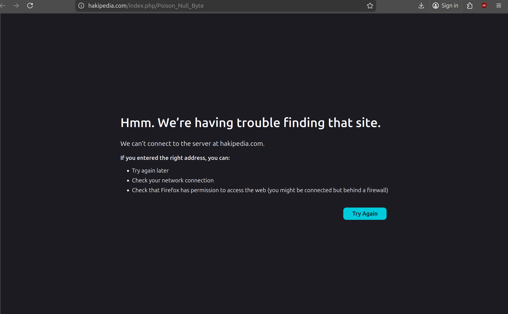
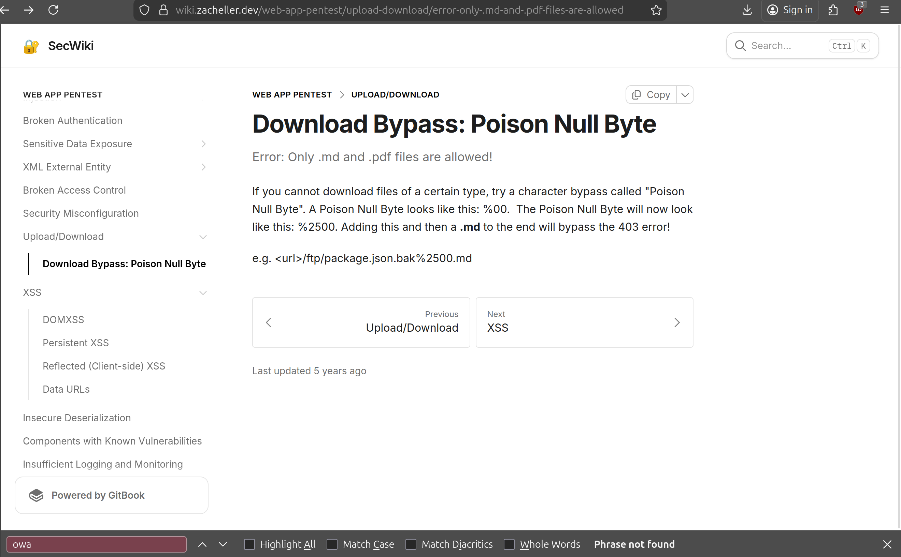
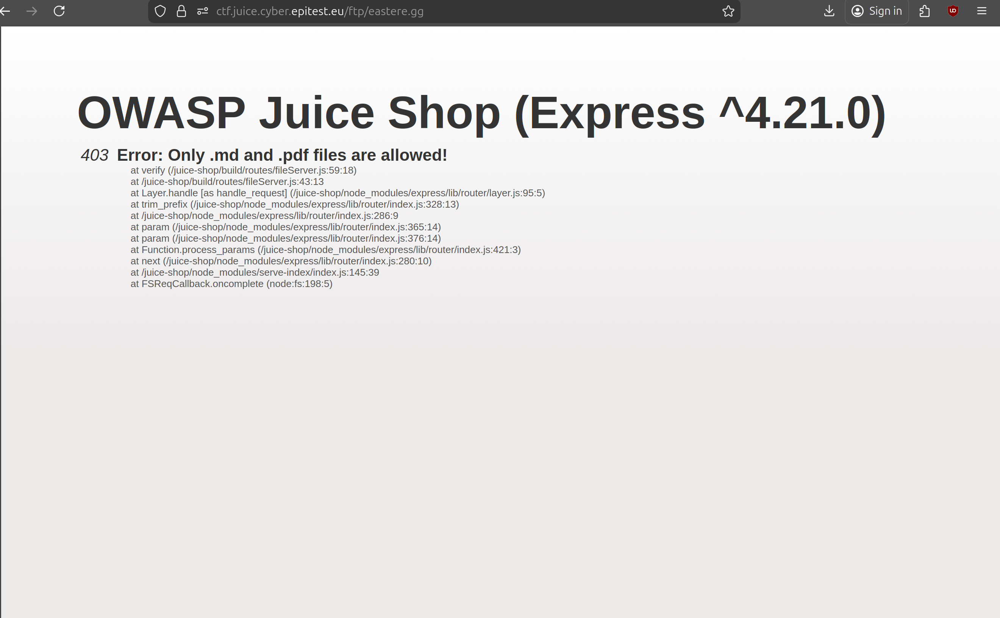

# Poison Null Byte 4*:

## Description of the challenge:
Bypass a security control with a Poison Null Byte to access a file not meant for your eyes. (Difficulty Level: 4)

## Methodology:
### Steps:
- 1: First, figure out what a poison null byte is, because the link offered by the challenge doesn't, work (see image 1), By looking around a bit, I found a site called SecWiki that explained how to use it (see image 2)

- 2: Go to https://ctf.juice.cyber.epitest.eu/ftp and find a file you can't download (like eastere.gg)

- 3: Add the Poison Null Byte (this will also give you the [easter_egg](<../Broken Access Control/Broken Access Control-4-Easter Egg.md>) challenge if you did it on the eastere.gg file)

### Techinques:
- Research
- Brute force

### Tools:
- [SecWiki](https://wiki.zacheller.dev)
## Vulnerabilities:

### Name: 
Improper Input Validation
### Affected components:
- Secret Files
### Severity Level:
- (jsp va poser la question)

## Risks:
### Impact:
- Could potentially be used to reveal dev files and coupons and such prematurely to the public.

## Actions:
### Risk mitigation strategies:
- Clean up the files before making changes
### Remediation fixes:
- Don't leave unused files on the ftp and do not let normal users access the ftp.
### Related best security practices
- 
