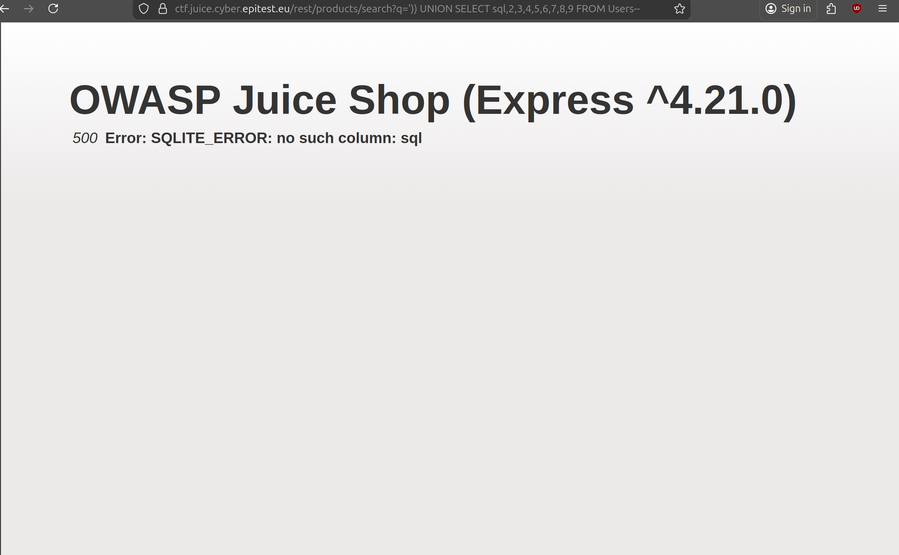
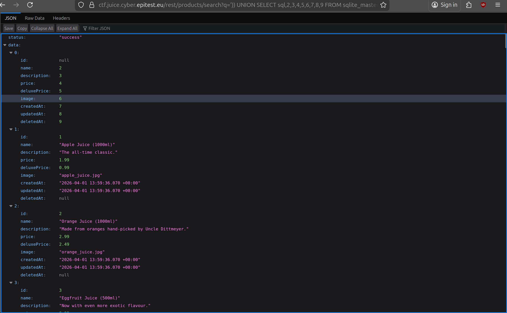

# Database Schema 3*:

## Description of the challenge:
Exfiltrate the entire DB schema definition via SQL Injection. (Difficulty Level: 3)

## Methodology:
### Steps:
- 1: While doing the User Credentials flag, I stumbled across the database 
[See_the_User_Credentials_flag](<./Injection-4-User Credentials.md), Since we wanted the schema, I replaced the first number with sql hoping to get the sql resquests to make the database got this error:

- 2: I remembered I was doing FROM Users, so I changed Users, to the place that holds schema for sqlite which is sqlite_master and we get the right result.

### Techniques:
- Research
- SQL Injections

### Tools:
- [SecWiki](https://wiki.zacheller.dev)
- [Injections](https://www.vectra.ai/topics/sql-injection) 
## Vulnerabilities:

### Name: 
Injection
### Affected components:
- The users account
### Severity Level:
- HIGH

## Risks:
### Impact:
- Could be used to retrieve the schema of the database, thus making requesting things from it easier

## Actions:
### Risk mitigation strategies:
### Remediation fixes:
- Use the built-in replacement (or binding) mechanism of Sequelize to creating a Prepared Statement. This prevents tampering with the query syntax through malicious user input as it is "set in stone" before the criteria parameter is inserted.
### Related best security practices
- Using the built-in replacement mechanism
