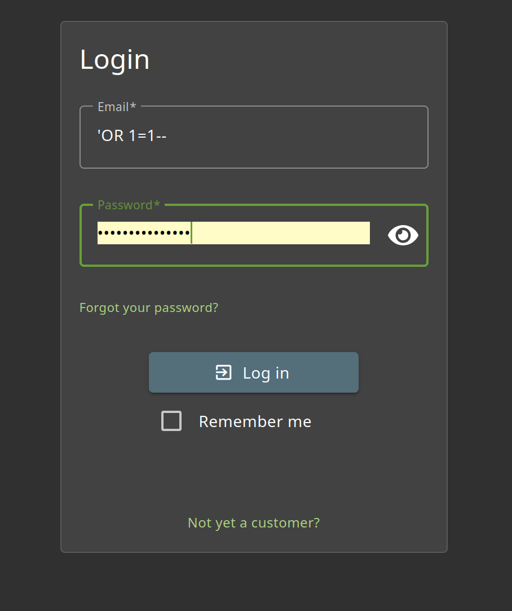
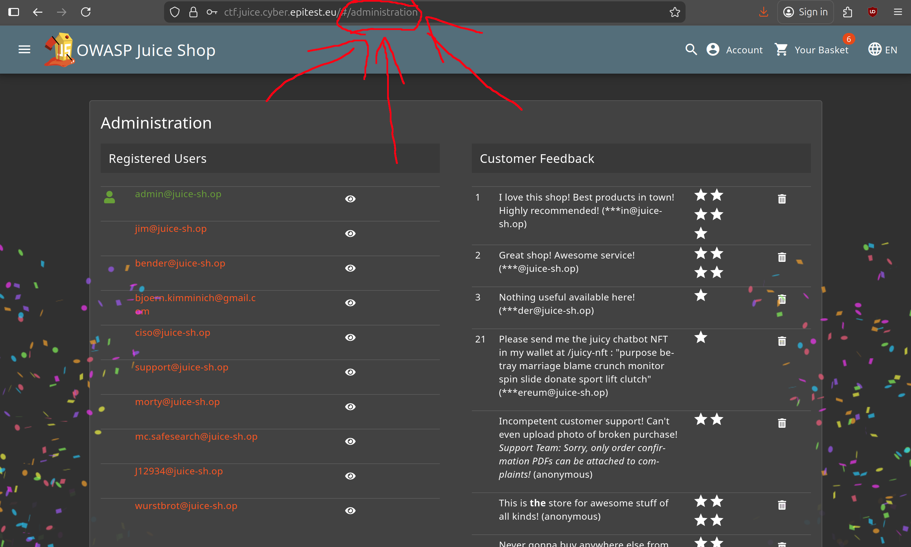
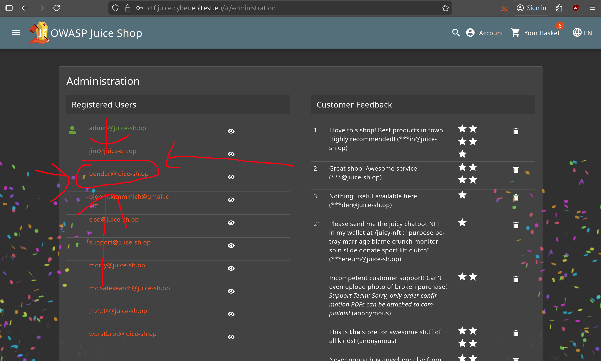
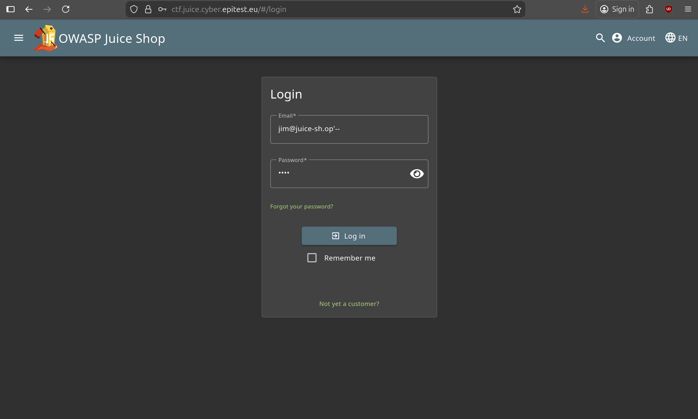

# Login Bender 3*:

## Description of the challenge:
Log in with Bender's user account. (Difficulty Level: 3)

## Methodology:
### Steps:
- 1: First, we need to figure out what Bender's email adress is, for that we can connect to the admin account and access the administration panel. To do that, we can do a simple sql injection.
For this method we used the fact that the site reads the login requests as so:
SELECT * FROM USERS WHERE email='input' AND password='input'
So by writing 'OR 1=1-- in the first field, we check that either the inputted value is in the database or 1=1 which is always true, thus it will connect us to the first account, which, fortunately is admin. 
(see image 1) [if you want to read more about it here you go](https://www.vectra.ai/topics/sql-injection) and then type /administration in the search bar (see image 2).

- 2: Find Bender's email address

- 3: Connect to Benders's account using another SQL Injection.
For this method we used the fact that the site reads the login requests as so:
SELECT * FROM USERS WHERE email='input' AND password='input'
So by writing bender@juice-sh.op'-- in the first field, we check that the email is valid, bnut not the password, thus allowing us to connect to any account, as long as we have the email.

### Techniques:
- Research
- SQL Injections

### Tools:
- [SecWiki](https://wiki.zacheller.dev)
- [Injections](https://www.vectra.ai/topics/sql-injection) 
## Vulnerabilities:

### Name: 
Injection
### Affected components:
- The users account
### Severity Level:
- VERY HIGH

## Risks:
### Impact:
- Could be used to retrieve users information, and order massive amounts of goods on their credit cards, this is very bad

## Actions:
### Risk mitigation strategies:
- Implement two factor authentification.
### Remediation fixes:
- Parameterized Queries: Use parameterized queries (prepared statements) that separate SQL code from data inputs, ensuring user inputs are treated as data only.
- Input Validation: Validate and sanitize all user inputs to ensure they conform to expected formats and reject potentially harmful data.
- Stored Procedures: Use stored procedures for database operations, which can help isolate and control the execution of SQL code.
- Least Privilege Principle: Grant the minimal necessary database privileges to application accounts to reduce potential damage from an SQL injection.
- Error Handling: Avoid exposing detailed error messages to users, as they can provide clues for constructing successful SQL injection attacks.
### Related best security practices
- 
