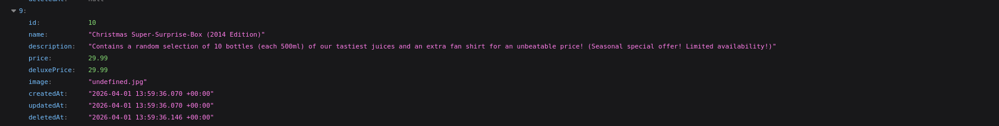
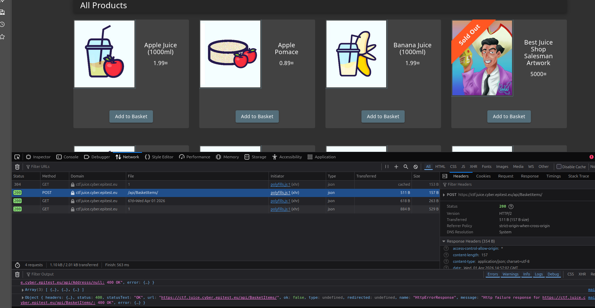
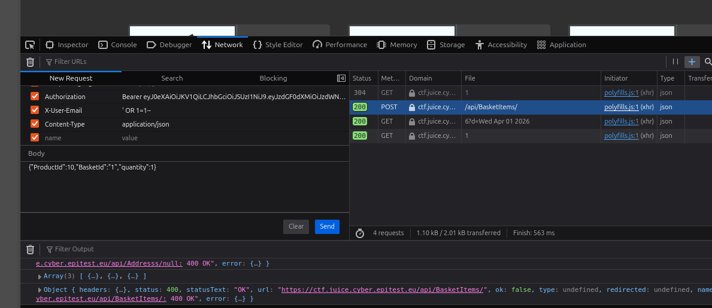
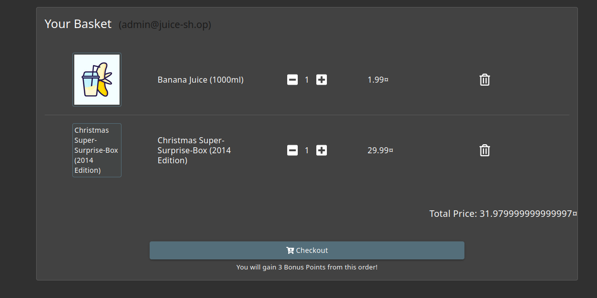

# Chritmas Special 4*:

## Description of the challenge:
Order the Christmas special offer of 2014. (Difficulty Level: 4)

## Methodology:
### Steps:
- 1: First, we need to get the ID of old objects  and special offers from the site. We can get those info from the database, we already accessed it wth the User Credential flag: [User Credential](./Injection-4-User%20Credentials.md)
Here's what the Offer we're looking for, at ID 10

- 2: Sadly this item can't be found directlty, so we'll need to add some other item to our basket, and then modify it to add the Christmas Special Offer instead.

- 3: When adding an item to the basket we can see the request sent to the server in the Network tab when inspecting. The request contains the product ID of the item, our Basket ID, and a quantity to add. Here the item we added has an ID of 6.

- 4: We can simply change the ID to 10 and send the modified request to add the Christmas Special Offer to our basket, instead of the original item:

- 5: Then we can finally proceed to checkout with the item.

### Techniques:
- Research
- Request modification

### Tools:
- Inspect
## Vulnerabilities:

### Name: 
Injection
### Affected components:
- Basket Content
### Severity Level:
- LOW

## Risks:
### Impact:
- negligeable, user could order items that no longer exist

## Actions:
### Risk mitigation strategies:
- Check validity of items before adding them to the baket, or before roceding to checkout.
### Remediation fixes:
- Delete old items and offers, dereferencing their IDs.
### Related best security practices
- 
