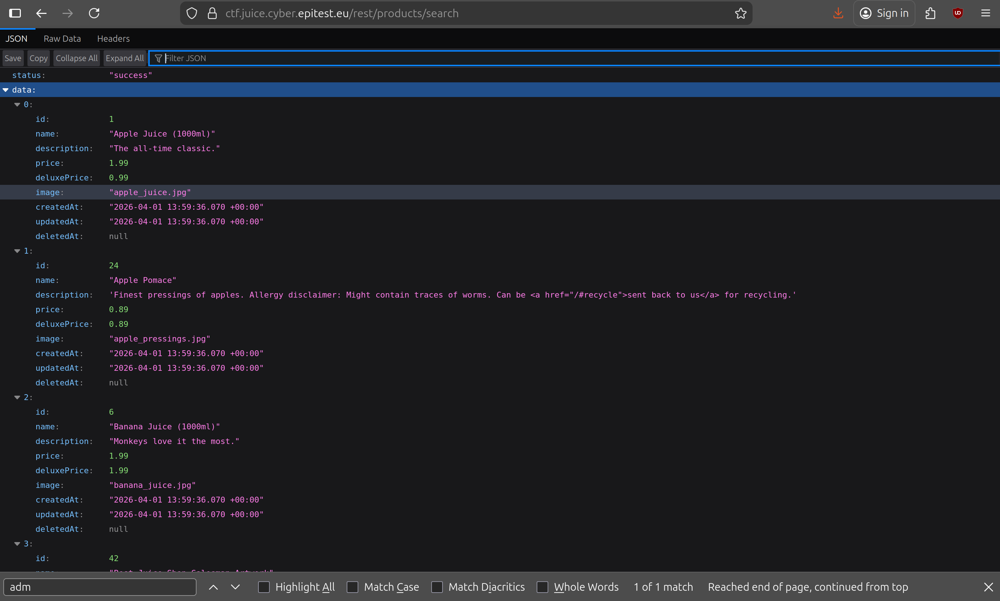
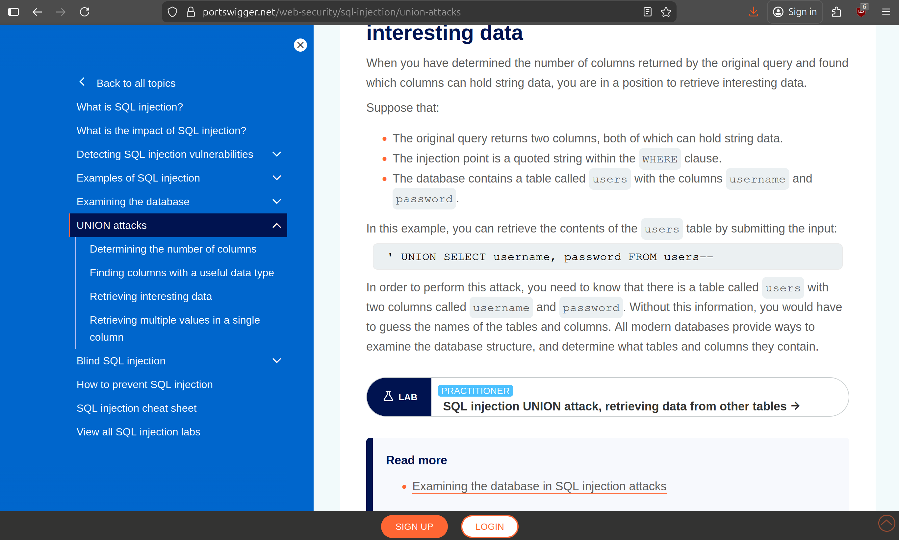
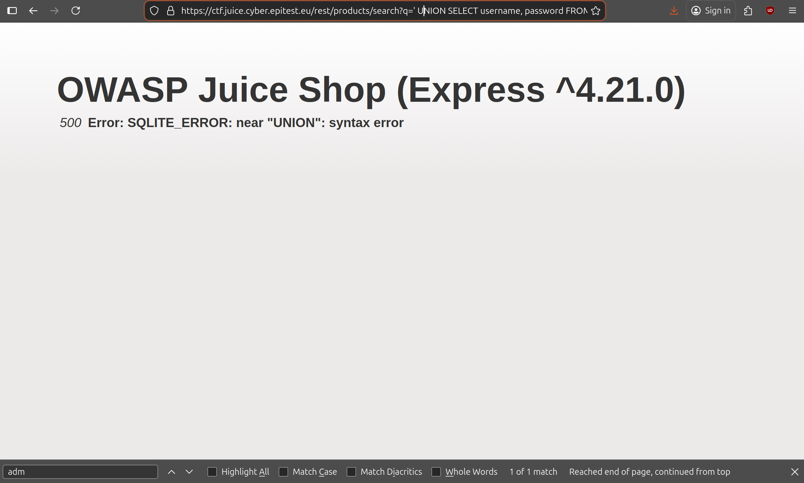
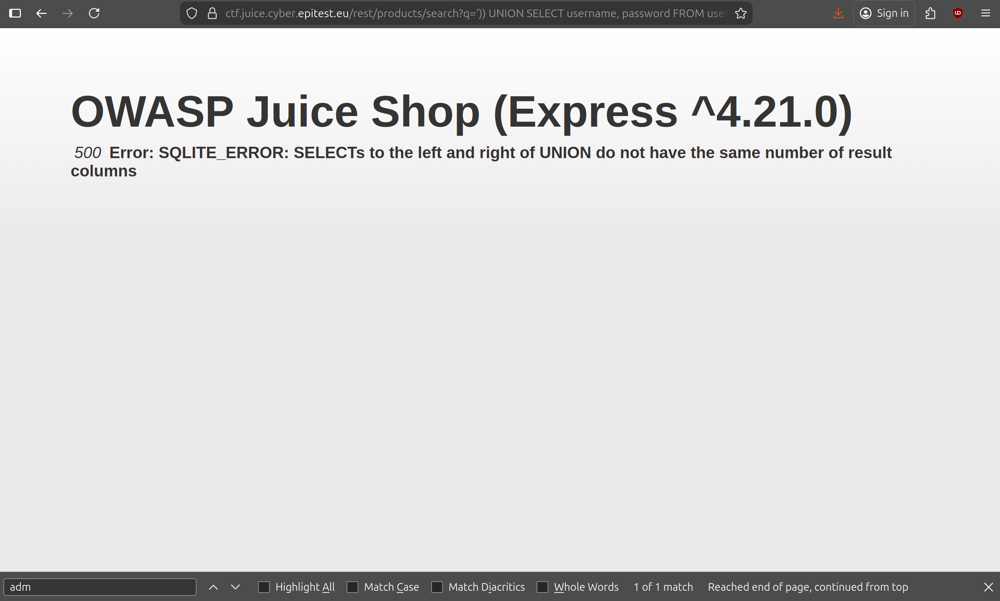
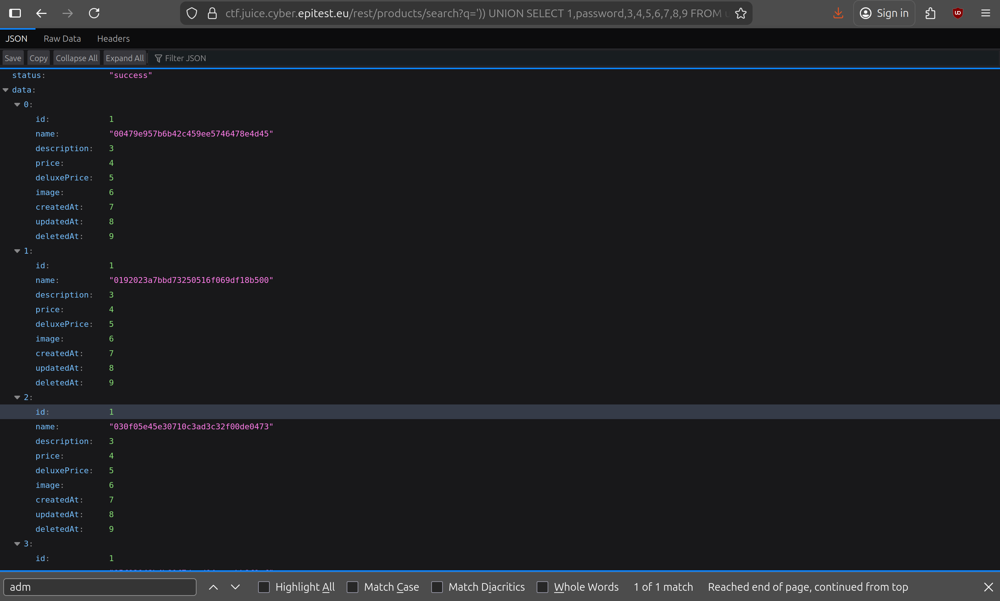
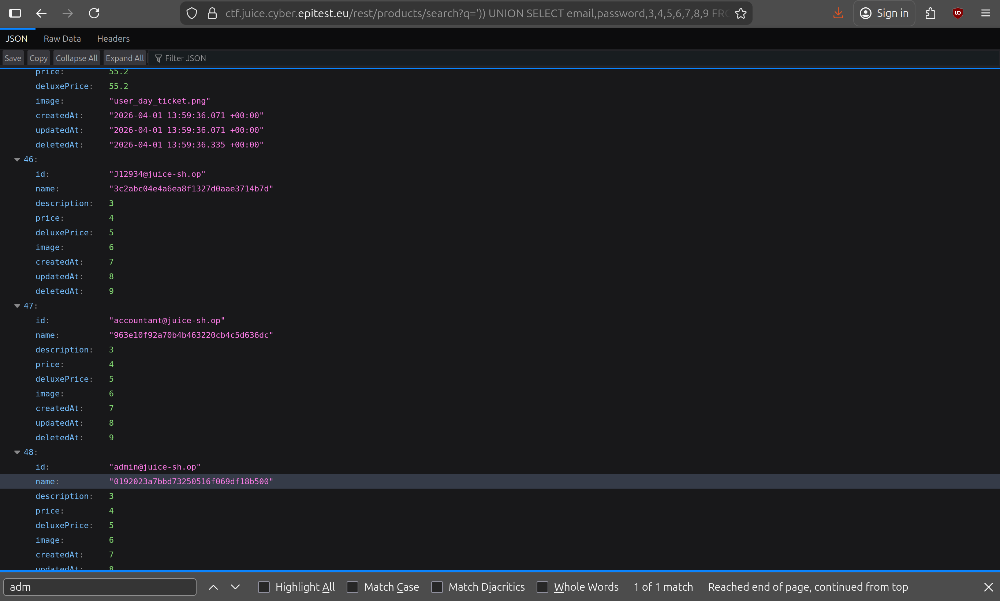

# User Credentials 4*:

## Description of the challenge:
Retrieve a list of all user credentials via SQL Injection. (Difficulty Level: 4)

## Methodology:
### Steps:
- 1: First, we need to figure out how to access the database, since the site uses a rest api, I tried to figure out how to query data from rest apis. [This link](https://learn.microsoft.com/en-us/rest/api/sql-server-reporting/folders/search-catalog-items-in-folder) helped me figure out how to access the products, to do so. I wrote /rest/products/search at the end of the url and I got something that looked like a database:

- 2: I realized that the only thing that was shown, was the products and I wanted the users, after finding [this website](https://portswigger.net/web-security/sql-injection/union-attacks) and reading this section (see image 1), I tried the request and I got this (see image 2).

- 3: I added parenthesis to the URL to close the search request and got a new error (see the image below), this error means that I did not UNION SELECT the right number of columns, so I looked back to /rest/products/search, saw that there were nine columns so I padded with numbers which made the URL look like this: "https://ctf.juice.cyber.epitest.eu/rest/products/search?q=')) UNION SELECT username,password,3,4,5,6,7,8,9 FROM users--" (I added the -- at the end to comment the rest to avoid syntax errors) 
and got the same result as before:

- 4: This meant that the column names were wrong. Since the site does not have usernames, I tried replacing username with 1 and got this instead:

- 5: It showed the hashed passwords but not the email adresses that were linked, so I changed 1 with email and got the right result.

### Techniques:
- Research
- SQL Injections

### Tools:
- [SecWiki](https://wiki.zacheller.dev)
- [Injections](https://portswigger.net/web-security/sql-injection/union-attacks) 
## Vulnerabilities:

### Name: 
Injection
### Affected components:
- Every user, connection
### Severity Level:
- VERY HIGH

## Risks:
### Impact:
- Could be used to retrieve users information and connect on any account. After that malicious users could order massive amounts of goods on their credit cards, or leave diffamatory comments in their name    this is very bad

## Actions:
### Risk mitigation strategies:

### Remediation fixes:
- Use the built-in replacement (or binding) mechanism of Sequelize to creating a Prepared Statement. This prevents tampering with the query syntax through malicious user input as it is "set in stone" before the criteria parameter is inserted.
### Related best security practices
- Using the built-in replacement mechanism