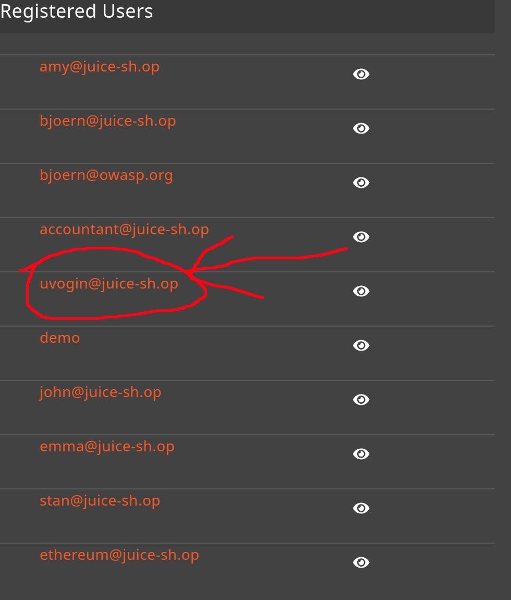
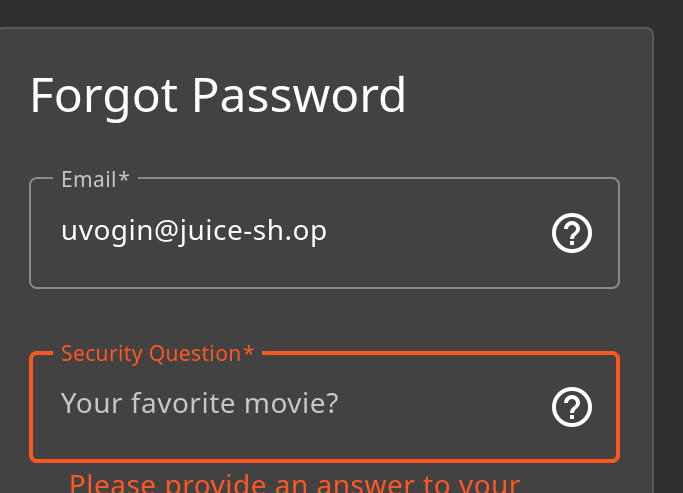
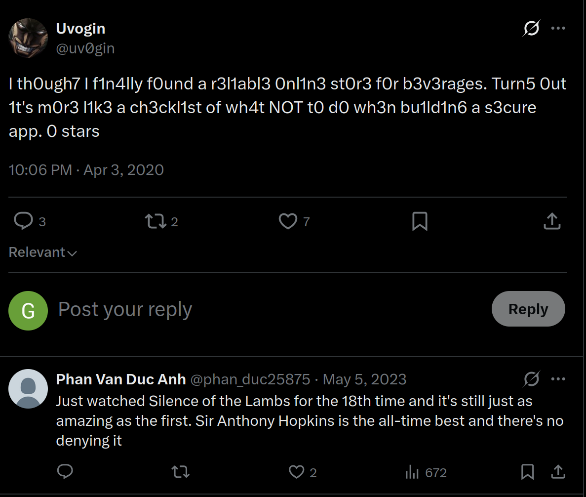

# Reset Uvogin's Password 4*:

## Description of the challenge:
Reset Uvogin's password via the Forgot Password mechanism with the original answer to his security question. (Difficulty Level: 4)

## Methodology:
### Steps:
- 1: Let's go have a look at what Uvogin's security question is, for that, let's access the admin panel like we did for [Login_bender](../Injection/Injection-3-Login%20Bender.md) or [Login_Jim](../Injection/Injection-3-Login%20Jim.md) and figure out their email address.

- 2: Then let's try to reset their password and see what their security question is:

- 3: To figure out what their favorite movie is, we first need to try and find their social media, where they might have talked about it, However, Uvogin is a character from Hunter X Hunter, so looking them up on twitter comes up with more Hunter X Hunter posts than theirs, plus there are several accounts called Uvogin, so we need to figure which one is theirs. On the reviews for the carrot juice products, we can find a review they wrote, and they write in an interesting fashion:

- 4: Using that, we can search for Uv0g1n on twitter and find their account, their only post on their has a comment talking about Silence of the Lambs

- 5: We input that as the security question and it works.

### Techniques:
- Internet snooping
- Brute force

### Tools:
- [Twitter](https://x.com)
## Vulnerabilities:

### Name: 
Sensitive Data Exposure
### Affected components:
- Uvogins account
### Severity Level:
- VERY HIGH
## Risks:
### Impact:
- Could be used to retrieve users information, and order massive amounts of goods on their credit cards, this is very bad

## Actions:
### Risk mitigation strategies:
- The site should use A2F or Uvogin should change their security question
### Remediation fixes:
- Change the security question
### Related best security practices
- Using A2F
